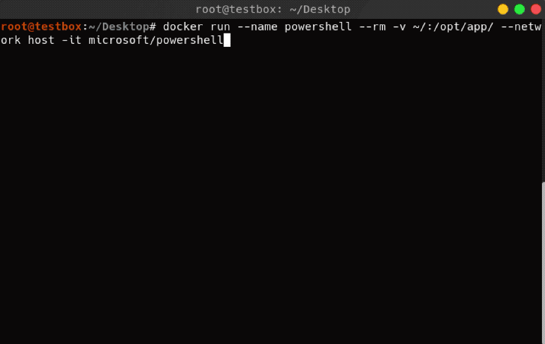

# Running Powershelll in Linux with Docker

Running Powershell in a one-liner is easy with Docker:
```bash
docker run --rm -v $(pwd):/opt/tmp -w /opt/tmp --network host -it microsoft/powershell
```

## Argument Breakdown
| Flag        | Description                                                                                                                                                                                                                |
|-------------|----------------------------------------------------------------------------------------------------------------------------------------------------------------------------------------------------------------------------|
| `--rm`      | Remove the container after completion. This is convenient for running single-use, interactive containers that do not need persistance.                                                                                     |
| `-v`        | Create a docker volume that binds a local directory with a directory within the container. Think of this like shared folders in a virtual machine                                                                          |
| `-w`        | Set the working directory to the /opt/tmp directory, this allows us to automatically change the directory to the docker volume we created with `-v`                                                                        |
| `--network` | This sets the network configuration of the docker container. In this case, `host` is one of 3 default networks available to Docker containers and exposes all listening services/ports in the container to the host.       |
| `-it`       | `--interactive` and `--tty`. These arguments allow the container to be run in Interactive mode and load a TTY driver. This allows use of tty features including tab-completion and history.                                |


